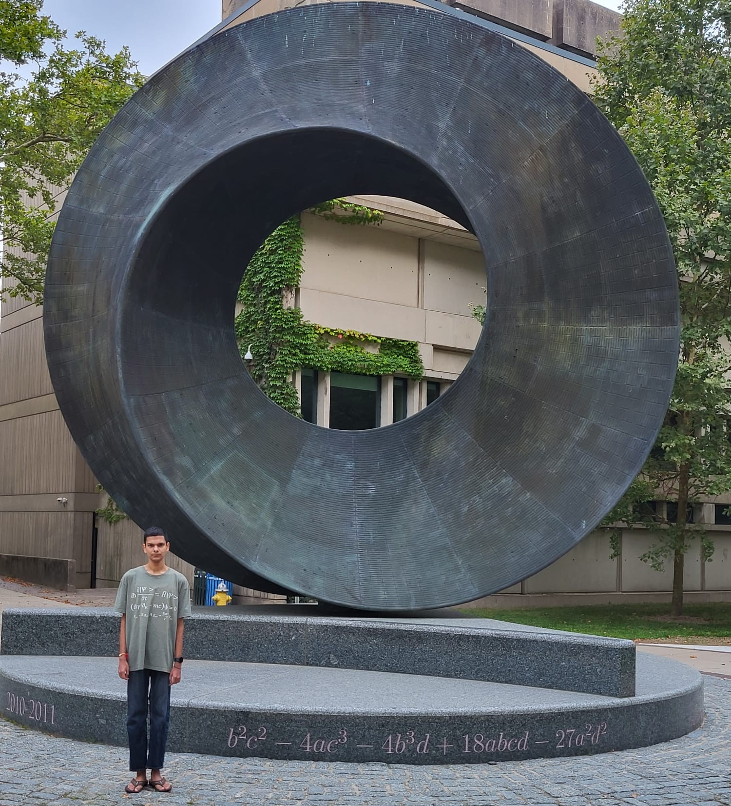

Welcome to my website! I am currently a first-year graduate student in the Department of Mathematics at Stony Brook University. I graduated from Rutgers University with a double major in astrophysics (highest honors) and mathematics (honors) in May 2025. My primary areas of research (proposed) are hyperbolic partial differential equations and mathematical physics. 

Please click on the above links to learn more about me. Thank you!

